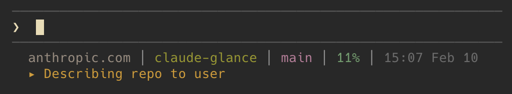

# claude-glance

> Your Claude sessions, at a glance.

**claude-glance** teaches Claude to maintain a live summary of what it's doing—displayed right in your statusline. No more wondering "what is it working on now?"



See that second line? **Claude writes that itself.** Proactively, automatically, in real-time.

## Install

```bash
npx github:ibro45/claude-glance install
```

Choose **project** (just this repo), **global** (all repos), or **both**. Restart Claude Code and you're done.

## Commands

```bash
npx github:ibro45/claude-glance install    # Interactive installer
npx github:ibro45/claude-glance status     # Check what's installed
npx github:ibro45/claude-glance uninstall  # Remove hooks and scripts
```

## What You're Seeing

**Line 1:** API domain, project folder, git branch, context %, time, and git diff (green `+` / red `-`)

**Line 2:** Claude's own summary—updating live as it works

Context turns red with ⚠️ at 70%+ to warn you the window is filling up.

## Requirements

- **Node.js** >= 16 (for `npx`)

Works on macOS and Linux.

## License

MIT — see [LICENSE](LICENSE)
